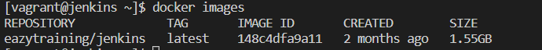
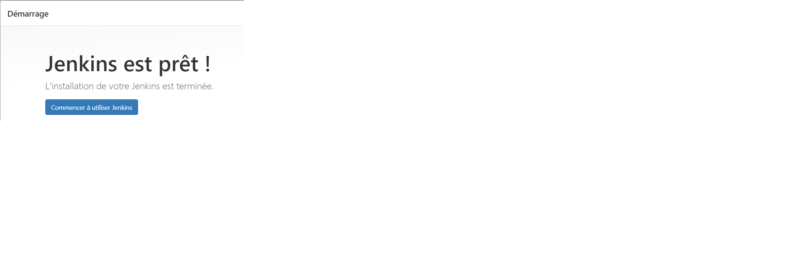
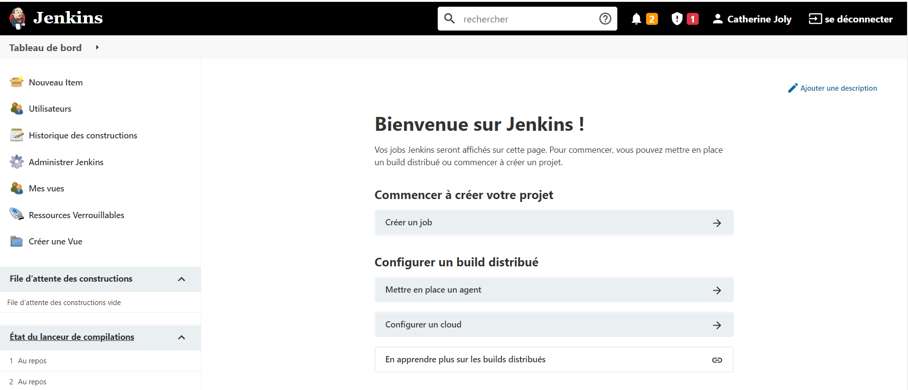
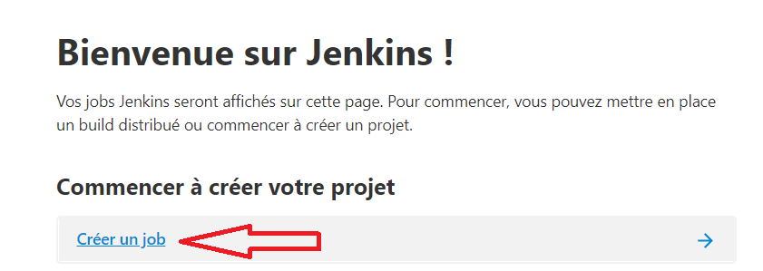
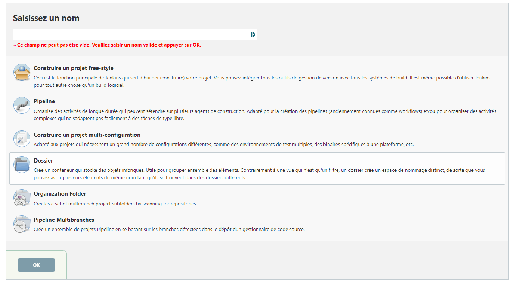
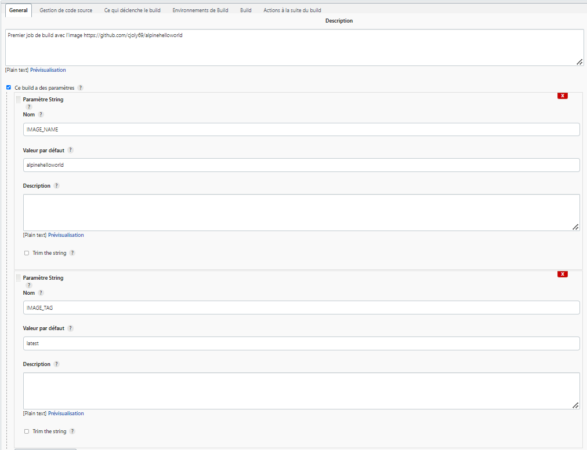
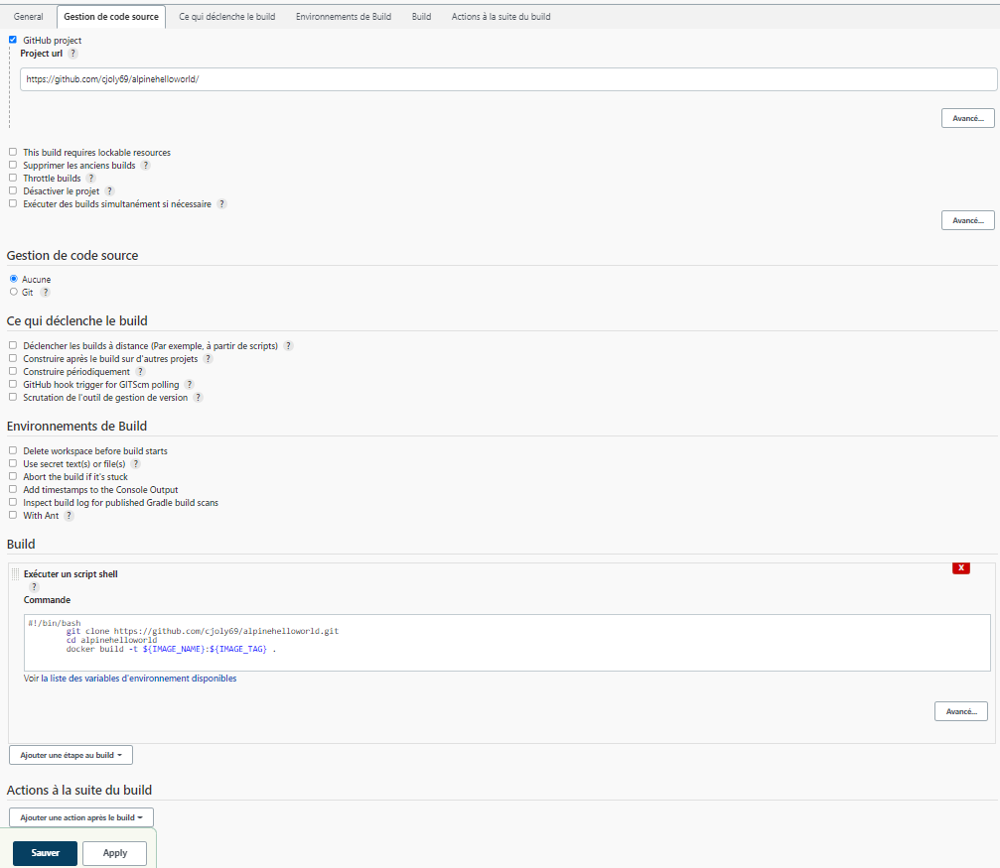
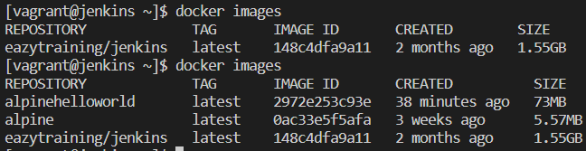

# Jenkins

Projet Jenkins 

Lancer l'installation depuis Vagrant

```
vagrant up --provision
```
Se connecter en ssh puis lancer jenkins dans docker dans laquelle on va récupérer le mdp jenkins
```
vagrant ssh
docker exec -it jenkins-jenkins-1 cat /var/jenkins_home/secrets/initialAdminPassword
```
Vérification de la présence de l'image docker


une fois le "initialAdminPassword" collé, la connexion à Jenkins est possible et on peut configurer le premier utilisateur



Bienvenue dans le tableau de bord !



Créer un premier job



Les différents types de jobs



Pour tester je crée un premier projet free style depuis le fork du repo git https://github.com/heroku/alpinehelloworld
dans la description j'ajoute des paramètres build de type string



Dans la partie build, on demande l'exécution de ce script shell pour cloner le dépôt dans le conteneur Docker
```bash
#!/bin/bash
		git clone https://github.com/${Votre_ID_GIT}/alpinehelloworld.git
		cd alpinehelloworld
		docker build -t ${IMAGE_NAME}:${IMAGE_TAG} .
```



C'est Jenkins qui va manager les ressources




